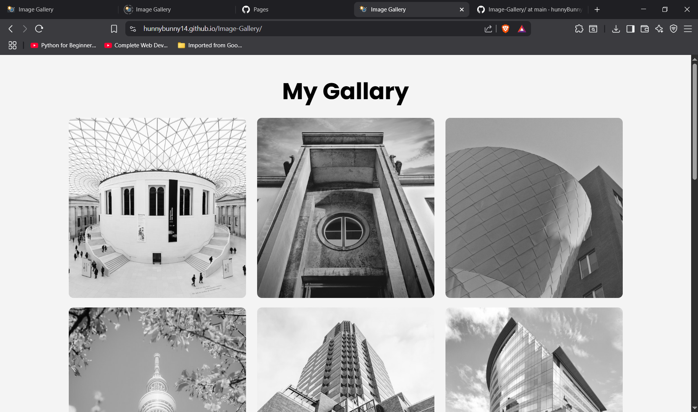

# 📷 Image Gallery

A responsive and modern **Image Gallery** built using **HTML** and **CSS**. This project demonstrates clean layout structuring, hover effects, and a minimalist design — perfect for beginners to sharpen front-end fundamentals.

---

## 🚀 Live Demo

👉 [Click here to view the live project](https://hunnyBunny14.github.io/Image-Gallery/)

---

## 🔍 Features

- ✅ Responsive grid layout using Flexbox
- ✅ Grayscale to color hover effect
- ✅ Caption overlay on hover
- ✅ Clean and readable UI with Google Fonts
- ✅ Footer section for branding

---

## 🛠️ Technologies Used

- HTML5
- CSS3
- Google Fonts (Poppins)

---

## 📁 Folder Structure

Image-Gallery/
├── index.html
├── style.css
├── favicon.ico
├── image1.jpg
├── image2.jpeg
├── ...
└── image15.jpg
---

## 🧠 Learning Outcomes

- Structuring semantic HTML
- Styling responsive layouts with Flexbox
- Implementing hover effects
- Organizing a project for GitHub hosting

---

## 📸 Preview

 

---

## 👤 Author

**Hunny Dhingia**  
🎓 B.Tech CSE (AI & ML), Graphic Era Dehradun  
🌐 [GitHub: hunnyBunny14](https://github.com/hunnyBunny14)

---

## ⭐ Show Your Support

If you liked this project:
- Give it a ⭐ on GitHub
- Share it with friends who are learning web dev
- Fork it and build on top of it!

---

